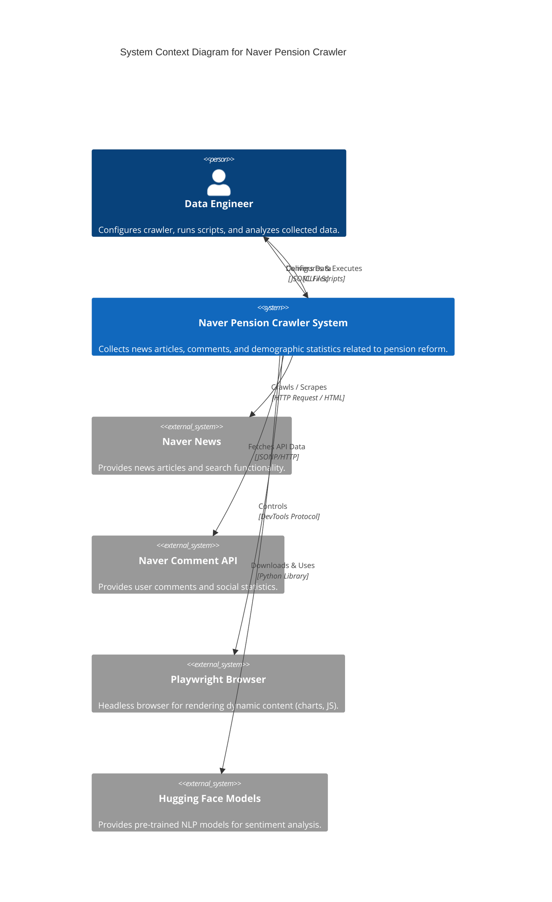
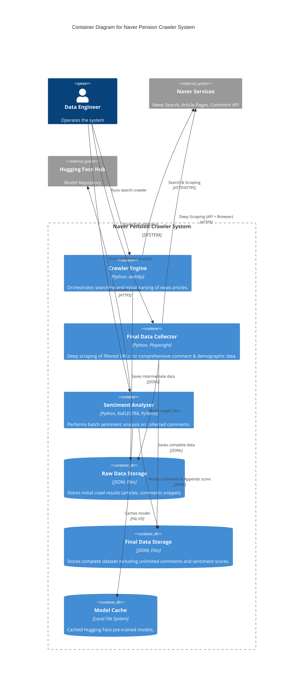

# Naver Pension Crawler 🕷️


## About

A high-performance asynchronous crawler designed to collect and analyze public opinion on **pension reform** from Naver News comments, featuring demographic data extraction and sentiment analysis.

## Key Features

- 🚀 **Hybrid Crawling Engine**: Intelligently switches between high-speed HTTP/API calls and headless browser (Playwright) to bypass bot protections and render dynamic JS content.
- 💬 **Massive Comment Collection**: capable of harvesting unlimited comments per article using the specialized Naver Comment API.
- 📊 **Demographic Extraction**: Scrapes age and gender distribution charts from news articles to contextualize public opinion.
- 🧠 **Sentiment Analysis**: Integrated **KoELECTRA** model to automatically classify Korean comments into Positive/Negative sentiments with confidence scores.
- 🛡️ **Robust Error Handling**: Implements exponential backoff, user-agent rotation, and semaphore-based concurrency control to respect rate limits.

## Architecture

### System Context (Level 1)

The system acts as a bridge between raw Naver News data and the Data Engineer, enriching the data with sentiment intelligence.



### Containers (Level 2)

The system is modularized into efficient Python containers for separation of concerns.



👉 **For more detailed architectural decisions, please refer to the [ADR Records](docs/ADR.md).**

## Getting Started

### Prerequisites

- Python 3.10+
- Chrome/Chromium (installed via Playwright)

### Installation

```bash
# 1. Clone the repository
git clone https://github.com/CSY-333/naver_pension_crawler.git
cd naver_pension_crawler

# 2. Install Python dependencies
pip install -r requirements.txt

# 3. Install browser binaries
playwright install
```

### Usage

1.  **Collect Data**:

    ```bash
    # Run the final data collection script
    py src/collect_final_data.py
    ```

    This will read URLs from `GPR_URLS/stats_urls.jsonl` and save results to `GPR_FINAL/`.

2.  **Analyze Sentiment**:
    ```bash
    # Run the sentiment analysis script
    py src/analyze_sentiment.py
    ```
    This processes the latest comment file in `GPR_FINAL/` and appends sentiment labels.

## Data Example

### Input (URL List)

```json
{
  "url": "https://n.news.naver.com/...",
  "date": "2024.01.01",
  "keyword": "국민연금"
}
```

### Output (Sentiment Analyzed Comment)

```json
{
  "comment_id": "123456789",
  "comment_text": "연금 개혁 반드시 필요합니다.",
  "author": "user****",
  "sentiment_label": "1",
  "sentiment_score": 0.9876
}
```

- `sentiment_label`: `1` (Positive), `0` (Negative)

## Tech Stack

- **Language**: Python 3.11
- **Crawling**: `aiohttp` (Async HTTP), `playwright` (Browser Automation), `beautifulsoup4`
- **NLP / ML**: `transformers` (Hugging Face), `torch` (PyTorch)
- **Model**: [jaehyeong/koelectra-base-v3-generalized-sentiment-analysis](https://huggingface.co/jaehyeong/koelectra-base-v3-generalized-sentiment-analysis)
- **Data**: JSONL (JSON Lines) for efficient large-scale storage
