# Naver Pension Crawler 🕷️


## 📖 About

**Naver Pension Crawler** is a high-performance **async data engineering pipeline** designed to extract, refine, and analyze public opinion on **pension reform**. It bridges the gap between raw web data and actionable intelligence by combining a hybrid crawler with a state-of-the-art sentiment analysis model.

---

## 🏗️ Architecture

This project goes beyond simple scraping, implementing a robust **Data Engineering Pipeline** that ensures stability, scalability, and data integrity.

### 1. Data Pipeline Overview

From raw extraction to intelligence generation, the data flows through strict phases.


### 2. System Interaction (Sequence Diagram)

How the components interact asynchronously to ensure non-blocking performance.


### 3. C4 Container Diagram

A high-level view of the system containers and their responsibilities.


---

## ⚡ Technical Highlights

### 🌊 Memory-Safe Streaming Processing

Processing **40,000+** comments requires efficient memory management. Unlike traditional "Bulk Loading" which can crash systems by loading all data into RAM, this project uses **Python Generators** to treat data as a continuous stream.

```mermaid
graph TD
    subgraph "⛔ Bulk Processing (Risky)"
        All[Load 4GB Data] -->|RAM Overflow| Crash(System Crash 💥)
    end

    subgraph "✅ Streaming (Optimized)"
        Stream[Input Stream] -->|Yield Line| Proc[Process 1 Record]
        Proc -->|Write| Save[Save to Disk]
        Save -->|Release Memory| Stream
    end

    style Crash fill:#ff6666,color:white
    style Save fill:#66ff66,color:black
```



> This ensures a **Constant Memory Footprint** regardless of dataset size.

### 🧠 Advanced Sentiment Analysis (KoELECTRA)

We utilize `koelectra-base-v3-generalized-sentiment-analysis`, a model fine-tuned on the NSMC dataset, specifically optimized for informal Korean text found in online comments.

```mermaid
graph TD
    Input[Comment: "연금 개혁 꼭 필요합니다!"] --> Tokenizer[KoELECTRA Tokenizer]
    Tokenizer -->|Encoding| Model[Pre-trained KoELECTRA-v3]
    Model -->|Feature Extraction| Classifier[Linear Layer]
    Classifier -->|Softmax| Output{Positive: 98.7%}

    style Input fill:#fff,stroke:#333
    style Output fill:#ffe,stroke:#f66,stroke-width:2px
```

---

## 🚀 Getting Started

### Prerequisites

- Python 3.10+
- `pip` & `git`

### Installation

```bash
git clone https://github.com/CSY-333/naver_pension_crawler.git
cd naver_pension_crawler
pip install -r requirements.txt
playwright install
```

### Usage

**1. Collect Data**

```bash
py src/collect_final_data.py
```

**2. Analyze Sentiment**

```bash
py src/analyze_sentiment.py
```

---

## 🛠️ Tech Stack

| Category     | Technology                                |
| ------------ | ----------------------------------------- |
| **Language** | Python 3.11                               |
| **Crawling** | `aiohttp`, `Playwright`, `BeautifulSoup4` |
| **Data Eng** | `Pandas`, JSONL (Streaming)               |
| **AI / ML**  | `Hugging Face Transformers`, `PyTorch`    |
| **Model**    | KoELECTRA-Base-v3 (Generalized Sentiment) |

## 📜 License

This project is licensed under the MIT License.
